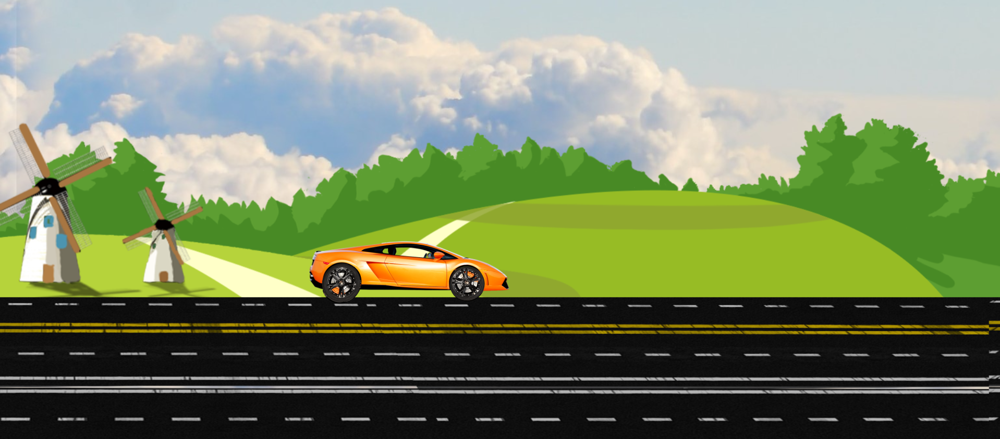

# Car Animation 🚗

A simple car animation using HTML, CSS, and JavaScript.



---

## 🛠️ Tech Stack


- Optional: Background music (`sound.mp3`)

---

## 📂 Project Structure
Car-Animation/
│
├─ index.html # Main HTML file
├─ style.css # Styling and animations
├─ script.js # JS for music and interactions
├─ car_wheel_left.png
├─ car_wheel_right.png
├─ car_body.png
├─ background.jpg
├─ trees.png
├─ track.png
├─ sound.mp3 # Background music
└─ README.md

---

## ⚡ Features
- Rotating **wheels animation**.
- **Shaking car body** effect for realism.

---

## 🚀 Installation & Usage

1. **Clone the repository**
```bash
git clone https://github.com/SaumikLaha/Car-Animation.git
